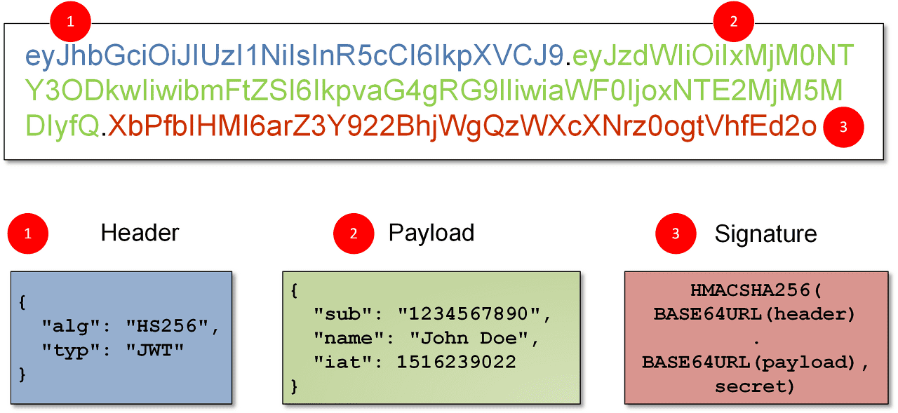

# Authentication: JSON Web Tokens
A common authentication mechanism used in the realm of [SPAs]() are [JSON Web Tokens](https://en.wikipedia.org/wiki/JSON_Web_Token) (or JWT for short). This type of authentication goes as follows:

* A user sends a **request**, containing her credentials, to a **log in** endpoint.
* If the credentials are valid, the servers sends back a **response** containing a **JWT**.
* The JWT must be saved **locally**, in the user's browser (more about this later).
* From there on, user's request will include the JWT received when she logged in.

> JWT authentication is an **alternative** to the traditional approach of creating a **session** in the server and returning a **cookie**.

JWT can be described as a [stateless](https://en.wikipedia.org/wiki/Stateless_protocol) authentication mechanism, as the user state is never saved in server memory. The server's protected routes will check for a valid JWT in the Authorization header, and if it's present, the user will be allowed to access protected resources.

> Another common authentication method used by APIs is known as **API key authentication**. Here, the user's send her **API key** on every request; once the request is received, the database is queried to check if the key is valid.

Compared to **API key authentication**, JWT authentication eliminates the need for querying the database on every single request (faster app). Only at login the database is queried to validate the credentials.

## What's in a token?
Once an authentication **request** has been validated, we can generate a **token** and return it as a **response**. A JWT (from now on, we'll refer to it simply as token) is simply a long string of text that contains some data to identify the user. For example:
```
xxxxxx.yyyyyy.zzzzzz
```

Above we've simplified quite a bit what a token would look like, but if you pay attention, there are three segments separated by two dots:

1. **Header**: typically consists of two parts:

    * `typ`: The **type of the token**, which is JWT.
    * `alg`: The **signing algorithm** being used, such as [HMAC](https://en.wikipedia.org/wiki/HMAC), [SHA256](https://en.wikipedia.org/wiki/SHA-2) or [RSA](https://en.wikipedia.org/wiki/RSA_(cryptosystem)).

2. **Payload**: which contains statements (known as [claims](https://datatracker.ietf.org/doc/html/rfc7519#section-4.1)) about an entity (typically, the user) and additional data.

3. **Signature**: which is made as follows:

    1. Encode the **header** as a [base64url](https://en.wikipedia.org/wiki/Base64#URL_applications) string.
    2. Encode the **payload** as a **base64url** string.
    3. Concatenate the two strings above, separated by a simple period (`.`).
    4. The resulting string is [hashed](https://en.wikipedia.org/wiki/Cryptographic_hash_function) using the algorithm specified in the header (`alg`). A good idea here is to use a **private key** (aka **secret key**) for the encrypting (hashing) process. This key can be **optionally** encoded in **base64** (not base64url).
    5. Finally, the hashed string is also encoded as a **base64url** string, and appended to the previous two strings using a period.

The image below contains a representation of a token:



## Cooking a token in PHP
If all we explained above sounds too complicated, in this section we'll get our hands dirty building our own JWT using handy PHP functions. All three JWT components must be encoded in [base64url](https://en.wikipedia.org/wiki/Base64#URL_applications) string, which is basically a **base64** string, but we have to manually convert the following three characters:

| Base64 |    Base64url     |
| ------ | ---------------- |
| `+`    | `-` (dash)       |
| `/`    | `_` (underscore) |
| `=`    | (removed)        |


So let's write a handy function for encoding in **base64url**:
```php
function base64urlEncode($str) {
    return str_replace (
        ['+', '/', '-'],
        ['-', '_', ''],
        base64_encode($str));
}
```

With this function we can easily encode the header and the payload:
```php
$header = base64urlEncode(json_encode([
    'alg' => 'HS256',
    'typ' => 'JWT'
]));

$payload = base64urlEncode(json_encode([
    'sub'   => '69',
    'email' => 'bob@gmail.com'
]));

$header = base64urlEncode($header);
$payload = base64urlEncode($payload);
```

In the code above we are encoding the header and payload as JSON strings before encoding them in [base64url](https://en.wikipedia.org/wiki/Base64#URL_applications). For the payload [claims](https://auth0.com/docs/secure/tokens/json-web-tokens/json-web-token-claims) we kept it simple, but it's worth mentioning here that using sensitive data here is not a good practice (if someone gets ahold of our private key, they'd have a way of decoding our tokens and gain access to that sensitive intel).

> Both `sub` (used for the **user id**) and `email` are **reserved claims** described in the [JWT standard](https://www.iana.org/assignments/jwt/jwt.xhtml#claims).

### The Signature
For the signature we're gonna be using the algorithm that we set in the header, **HS256** which is [HMAC](https://en.wikipedia.org/wiki/HMAC) with [SHA-256](https://en.wikipedia.org/wiki/SHA-2). This is a a symmetric **keyed** hashing algorithm, so we're gonna need to create a key. That could easily get done using any of the onlines **encryption key generator** such as https://www.allkeysgenerator.com/. We'll be needing a **256-bit** key, since that's the same size of the output string generated with **HS256**. The key should look something like this:
```
5468576D5A7134743777217A25432646294A404E635266556A586E3272357538
```

> When generating the key we ticked the option to generate it using **hexadecimal** characters.

Now we can use this key to generate the signature:
```php
$secret = '5468576D5A7134743777217A25432646294A404E635266556A586E3272357538';

$signature = hash_hmac(
    'sha256',
    "$header.$payload",
    base64_encode($secret),
    true);

$signature = base64urlEncode($signature);
```

The [hash_hmac](https://www.php.net/manual/en/function.hash-hmac) function is self-explanatory. Note how we separated the header and the payload by a dot (`.`). Worth mentioning the last `true` argument, which is used to make the output binary.

> Encoding the **secret** as base64 is **optional**. It's also a good idea **not** to commit your **secret key** to **source control** (meaning github dawg ;-)

Once we have the three JWT components, we just have to join them together, separated by a dot:
```php
$jwt = "$header.$payload.$signature";
```

Once we have our **token**, it's a good idea to check out that our result matches the real deal in https://jwt.io/. So we could copy it and paste it in the proper box there.

> An error I was getting at the bottom of the page was **Invalid Signature**. It was due to leaving a **trailing comma** in the PHP **associative array** that I was using for the **payload** and **header** (maybe it was generating different JSON).

## Sending a token in the Response
Once we have successfully validated the user's credentials and generated a token, we just have to send it back to the user. There's not much we can explain here; just send it :-)


## User receives the token
Once we've generated and sent the JWT to the user in our response, where should she put it once she receives it? There are several options for this:

1. [Session storage](https://developer.mozilla.org/en-US/docs/Web/API/Window/sessionStorage).

    * The token will accessible only **one tab**.
    * Once the tab is closed, the session data got destroyed. So it's not a valid option if we intend to add a feature like [remember me](https://www.phptutorial.net/php-tutorial/php-remember-me/).
    * We have to **manually send the token** on each request.
    * Susceptible to [XSS attacks](https://en.wikipedia.org/wiki/Cross-site_scripting).

2. [Local storage](https://developer.mozilla.org/en-US/docs/Web/API/Window/localStorage).

    * The token will accessible in **multiple tabs**.
    * It provides persistence across **page refreshes**. 
    * We have to **manually send the token** on each request.
    * Susceptible to [XSS attacks](https://en.wikipedia.org/wiki/Cross-site_scripting).
    * [Auth0](https://auth0.com/docs/secure/security-guidance/data-security/token-storage#browser-local-storage-scenarios) says it's aight when used along with token expiration.

3. [HTTP cookies](https://developer.mozilla.org/en-US/docs/Web/HTTP/Cookies) (used with the `HttpOnly`  and `secure`).

    * If we set the `SameSite=strict` we are protected against [CSRF](https://en.wikipedia.org/wiki/Cross-site_request_forgery).
    * If we set the `HttpOnly` we are protected against [XSS attacks](https://en.wikipedia.org/wiki/Cross-site_scripting).
    * The browser **automatically sends** the cookie on each request.

4. [Web Workers](https://developer.mozilla.org/en-US/docs/Web/API/Web_Workers_API) is the to go option recommended by [Auth0](https://auth0.com/docs/secure/security-guidance/data-security/token-storage#browser-in-memory-scenarios).

All these three options have pros and cons. We'll go into details about our choice in the front-end section. Regardless of the choice, the token is added to the **request** by setting the HTTP [Authorization](https://developer.mozilla.org/en-US/docs/Web/HTTP/Headers/Authorization) request header when she makes her [fetch](https://developer.mozilla.org/en-US/docs/Web/API/Fetch_API) requests (or any other AJAX tingy). This header looks like this:
```
Authorization: <auth-scheme> <authorization-parameters>
```

Where:

1. `<auth-scheme>` stands for the [authentication scheme](https://developer.mozilla.org/en-US/docs/Web/HTTP/Authentication#authentication_schemes); we'll use the value [Bearer](https://datatracker.ietf.org/doc/html/rfc6750).
2. `<authorization-parameters>` stands for the token itself.

## Validating the token in the Requests
When the user sends back the token on each **request**, be it **automatically** (with HttpOnly cookies) or **manually** (in the case of local storage), our **backend** must check that the token is included in the **request** (otherwise access to API resources won't be granted).


We do that by accessing the value of `$_SERVER['HTTP_AUTHORIZATION']` and running on it a **validating function** that we'll explain a bit later.

> If you find a problem when trying to access the value of the `Authorization` header in the [$_SERVER](https://www.php.net/reserved.variables.server) PHP super global, read the next section.

### Woops! Where's the Authorization Header
It may well be, that the `Authorization` header we just mentioned is not present in the [$_SERVER](https://www.php.net/reserved.variables.server) super global (under the `HTTP_AUTHORIZATION` key). This is an **issue** with the [Apache Web Server](https://httpd.apache.org/) (💩), which removes the header before PHP can read it. To solve that, we can take two different approaches:

* Using the [apache_request_headers](https://www.php.net/manual/en/function.apache-request-headers.php) PHP function, that returns an array with **all** of the HTTP request headers.
* Configure **Apache** so that the `Authorization` header is available in PHP. We could set this configuration in the virtual hosts file for our site, or in our `.htaccess` file.

Since we're already using an `.htacess` file for [URL rewriting](https://en.wikipedia.org/wiki/Rewrite_engine), we'll add there the following line at the bottom of the file:
```
SetEnvIf Authorization "(.*)" HTTP_AUTHORIZATION=$1
```

Once we've added the line above, we'll be able of accessing the token under the `$_SERVER['HTTP_AUTHORIZATION']` header of each request.

> Note that, with this setting in place, the header value will be set **anyways**, so if a user's request doesn't set the header, `$_SERVER['HTTP_AUTHORIZATION']` will contain an **empty string**.

## Decoding tokens
Ok, so let's say we're receiving the tokens in the user's requests. We need a way to **decode** them in order to:

* Verify that they are **valid tokens** issued by us.
* Determine the user that concrete token identifies, so that we can give her access to the pertinent resources.

For this task we'll write a method that basically will run in reverse the steps we took to create the token (check the code for details). The decoding function will:

1. Split the token into its three components: header, payload and signature.
2. Recalculate a new signature with the first two components.
3. Compare the new signature with the third component (the signature included in the token). If they're the same, we'll return the **decoded payload**, otherwise `false`.

> To test the decoding function, send a `POST` request to the `/api/login` with your credentials. Copy the token and send it in the header of a `GET` request to the same endpoint ([Postman](https://www.postman.com/) really comes in handy here).

## Expiring tokens

## Refresh tokens and Access tokens

---
[:arrow_backward:][back] ║ [:house:][home] ║ [:arrow_forward:][next]

<!-- navigation -->
[home]: ../README.md
[back]: ./router.md
[next]: #