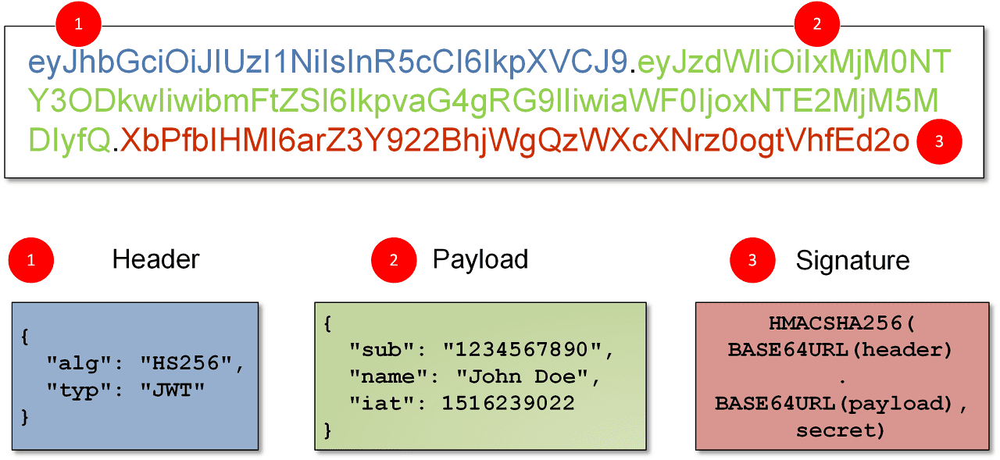

# JWTs are just Strings
A JWT (from now on, we'll refer to it simply as token) is simply a long string of text that contains some data to identify the user. For example:
```
xxxxxx.yyyyyy.zzzzzz
```

Above we've simplified quite a bit what a token would look like, but if you pay attention, there are three segments separated by two dots:

1. **Header**: typically consists of two parts:

    * `typ`: The **type of the token**, which is JWT.
    * `alg`: The **signing algorithm** being used, such as [HMAC](https://en.wikipedia.org/wiki/HMAC), [SHA256](https://en.wikipedia.org/wiki/SHA-2) or [RSA](https://en.wikipedia.org/wiki/RSA_(cryptosystem)).

2. **Payload**: which contains statements (known as [claims](https://datatracker.ietf.org/doc/html/rfc7519#section-4.1)) about an entity (typically, the user) and additional data.

3. **Signature**: which is made as follows:

    1. Encode the **header** as a [base64url](https://en.wikipedia.org/wiki/Base64#URL_applications) string.
    2. Encode the **payload** as a **base64url** string.
    3. Concatenate the two strings above, separated by a simple period (`.`).
    4. The resulting string is [hashed](https://en.wikipedia.org/wiki/Cryptographic_hash_function) using the algorithm specified in the header (`alg`). A good idea here is to use a **private key** (aka **secret key**) for the encrypting (hashing) process. This key can be **optionally** encoded in **base64** (not base64url).
    5. Finally, the hashed string is also encoded as a **base64url** string, and appended to the previous two strings using a period.

The image below contains a representation of a realistic token:



## Cooking a token in PHP
If all we explained above sounds too complicated, in this section we'll get our hands dirty building our own JWT using handy PHP functions. All three JWT components must be encoded in [base64url](https://en.wikipedia.org/wiki/Base64#URL_applications) string, which is basically a **base64** string, but we have to manually convert the following three characters:

| Base64 |    Base64url     |
| ------ | ---------------- |
| `+`    | `-` (dash)       |
| `/`    | `_` (underscore) |
| `=`    | (removed)        |


So let's write a handy function for encoding in **base64url**:
```php
function base64urlEncode($str) {
    return str_replace (
        ['+', '/', '-'],
        ['-', '_', ''],
        base64_encode($str));
}
```

With this function we can easily encode the header and the payload:
```php
$header = base64urlEncode(json_encode([
    'alg' => 'HS256',
    'typ' => 'JWT'
]));

$payload = base64urlEncode(json_encode([
    'sub'   => '69',
    'email' => 'bob@gmail.com'
]));

$header = base64urlEncode($header);
$payload = base64urlEncode($payload);
```

In the code above we are encoding the header and payload as JSON strings before encoding them in [base64url](https://en.wikipedia.org/wiki/Base64#URL_applications). For the payload [claims](https://auth0.com/docs/secure/tokens/json-web-tokens/json-web-token-claims) we kept it simple, but it's worth mentioning here that using sensitive data here is not a good practice since the **payload** is just base64url **encoded** but **not encrypted** (if someone gets ahold of the token, it's easy to decode the token and gain access to that sensitive intel).

> Both `sub` (used for the **user id**) and `email` are **reserved claims** described in the [JWT standard](https://www.iana.org/assignments/jwt/jwt.xhtml#claims).

### The Signature
For the signature we're gonna be using the algorithm that we set in the header, **HS256** which is [HMAC](https://en.wikipedia.org/wiki/HMAC) with [SHA-256](https://en.wikipedia.org/wiki/SHA-2). This is a a symmetric **keyed** hashing algorithm, so we're gonna need to create a key. That could easily get done using any of the onlines **encryption key generator** such as https://www.allkeysgenerator.com/. We'll be needing a **256-bit** key, since that's the same size of the output string generated with **HS256**. The key should look something like this:
```
5468576D5A7134743777217A25432646294A404E635266556A586E3272357538
```

> When generating the key we ticked the option to generate it using **hexadecimal** characters.

Now we can use this key to generate the signature:
```php
$secret = '5468576D5A7134743777217A25432646294A404E635266556A586E3272357538';

$signature = hash_hmac(
    'sha256',
    "$header.$payload",
    base64_encode($secret),
    true);

$signature = base64urlEncode($signature);
```

The [hash_hmac](https://www.php.net/manual/en/function.hash-hmac) function is self-explanatory. Note how we separated the header and the payload by a dot (`.`). Worth mentioning the last `true` argument, which is used to make the output binary.

> Encoding the **secret** as base64 is **optional**. It's also a good idea **not** to commit your **secret key** to **source control** (meaning github dawg ;-)

Once we have the three JWT components, we just have to join them together, separated by a dot:
```php
$jwt = "$header.$payload.$signature";
```

Once we have our **token**, it's a good idea to check out that our result matches the real deal in https://jwt.io/. So we could copy it and paste it in the proper box there.

> An error I was getting at the bottom of the page was **Invalid Signature**. It was due to leaving a **trailing comma** in the PHP **associative array** that I was using for the **payload** and **header** (maybe it was generating different JSON).

The whole point of the signature is to ensure that the token has been issued by us. If someone steals some token, and modify the payload (easy to do) with the info of another user (in order to gain access to her resources) our decoding function will detect that the signature doesn't match.

---
[:arrow_backward:][back] ║ [:house:][home] ║ [:arrow_forward:][next]

<!-- navigation -->
[home]: ../../README.md
[back]: ../basic_flow.md
[next]: ./refresh_tokens.md